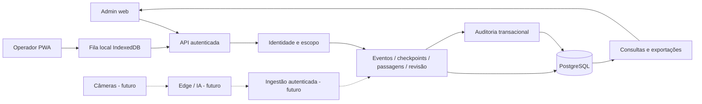

# Arquitetura proposta

## Estratégia

Monólito modular no MVP: aplicação web responsiva/PWA, API e PostgreSQL. Uma base de domínio para capturas, autorização e revisão. Evitar microserviços, broker e GPU antes de demonstrar necessidade. A arquitetura futura é planejada por contratos; não é necessário construir antecipadamente todos os componentes.

Proposta de stack: TypeScript no frontend e backend, React no cliente, Node.js com framework HTTP estruturado no servidor e PostgreSQL. Framework exato, ORM, versões e provedor serão fixados no primeiro incremento após prova de integração. Não há dependência obrigatória dos frameworks citados no PDF.



## Módulos e responsabilidades

- Identidade: usuários, organizações, memberships, credenciais de campo e sessões.
- Configuração: eventos, modalidade, checkpoints, janelas de captura e estados.
- Captura: validação, escopo, idempotência, persistência e qualidade temporal.
- Revisão: revisões imutáveis, invalidação, justificativa e projeção vigente.
- Consulta: painel paginado, exportação e contagens; não altera observações.
- Auditoria: ator, ação, recurso, organização, horário e correlação; transacional para mutações.
- Futuro: resultado, integração, mídia e IA, cada um com interfaces próprias.

Camadas: transporte HTTP → casos de uso → domínio → repositórios. Regra de cronometragem não fica nos componentes React. Domínio não depende do modelo de visão computacional.

## Organização sugerida do código

```text
apps/web/                 admin e operação de campo
apps/api/                 API e módulos do domínio
packages/contracts/       schemas e tipos versionados
packages/domain/          regras independentes de transporte
infra/                    ambientes e deploy
tests/                    integração, E2E e carga
doc/                      este conjunto
```

## Consistência

Gravar passagem, chave idempotente e auditoria na mesma transação. Retornar confirmação só após commit. Usar unicidade no banco para concorrência, não somente consulta prévia. No MVP, atualizar painel por polling de aproximadamente 3 segundos enquanto visível; mostrar timestamp da última consulta. F2 pode adotar SSE conforme medição.

Organização vem da sessão, nunca de um campo confiado do cliente. Todas as entidades de negócio carregam `organization_id`, com FKs compostas evitando associação entre organizações. RLS é defesa adicional; conexão de aplicação não deve ser superusuário, dona das tabelas ou ter BYPASSRLS. Contexto de tenant precisa ser definido por transação e não vazar pelo pool. [Referência PostgreSQL](https://www.postgresql.org/docs/current/ddl-rowsecurity.html).

## Evolução

F2 adiciona motor de resultados e outbox transacional para notificações/integrações. F3–F5 adicionam workers Python no edge, armazenamento privado de evidências e ingestão de candidatos. Comunicação por contrato versionado, com identidade de máquina e backpressure; nunca escrita direta da IA no banco principal.

Broker, Redis, Kubernetes e separação de serviços são decisões condicionadas a volume, disponibilidade e equipe. Falha do pipeline de IA não deve impedir registro manual. Funcionalidades de IA ficam atrás de flags por organização/evento/checkpoint.


## SA-01 — especificação concluída em 23/09/2026

Consultar [regras e arquitetura do super admin](39-super-admin-regras-e-arquitetura.md). Define a atualização antes do deploy; não representa recursos já implementados. Preserva os fluxos existentes e acrescenta isolamento de sessão, MFA e gestão de contas nas etapas SA-02 a SA-06.
