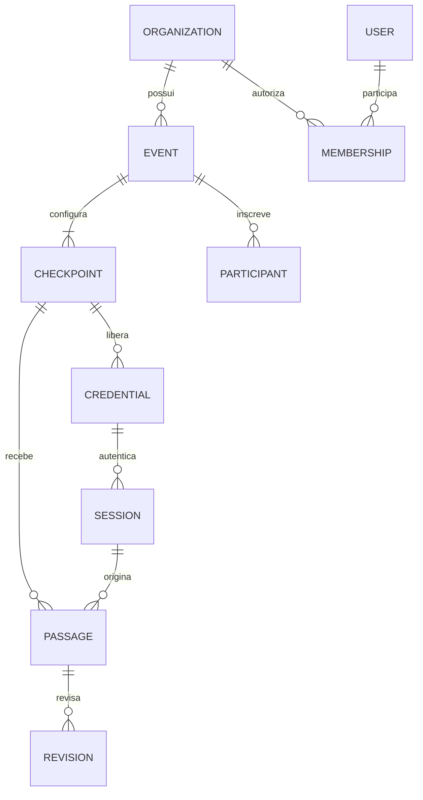

# Modelo lógico de dados

Modelo proposto; migrations executáveis serão criadas na implementação. UUID para identificadores; `timestamptz` em UTC para instantes; fuso IANA separado no evento; duração em milissegundos inteiros; distância em metros; número de peito como texto.

## Entidades do MVP

- `organizations`: id, name, status, created_at.
- `users`: id, email_normalized único, password_hash, status. Conta global sem dados esportivos.
- `memberships`: organization_id, user_id, role; unicidade do par.
- `events`: id, organization_id, name, local_date, timezone, location, state, version, created_by.
- `race_categories` (modalidades): id, organization_id, event_id, name, distance_m opcional, gun_start_at; exatamente uma por evento no MVP, sem confundir modalidade com categoria etária.
- `capture_windows`: id, organization_id, event_id, opened_at, closed_at opcional, reason; reabertura cria nova janela.
- `checkpoints`: id, organization_id, event_id, race_category_id, name, kind, sequence, distance_m opcional, active, version.
- `checkpoint_credentials`: id, organization_id, event_id, checkpoint_id, code único, password_hash, label, valid_from, expires_at, revoked_at.
- `sessions`: id/hash do token, user_id ou credential_id, organization_id, device_id quando campo, expires_at, revoked_at; exatamente um tipo de principal.
- `devices`: id, organization_id, credential_id, label, last_seen_at; UUID operacional não equivale a atestado de hardware.
- `participants`: id, organization_id, event_id, bib_number, display_name opcional. Cadastro é P1; passagem não depende da existência dele.
- `passages`: id, organization_id, event_id, checkpoint_id, client_event_id, bib_number_raw, source, captured_at_raw, captured_at_estimated, received_at, clock_offset_ms, clock_rtt_ms, clock_measured_at, time_quality, device_id, credential_id, session_id, actor_user_id opcional, payload_hash, initial_status, review_reasons, created_at.
- `passage_revisions`: id, organization_id, passage_id, revision_number, action, effective_bib_number, effective_captured_at, effective_status, reason, actor_user_id, created_at; snapshot completo da decisão vigente em cada revisão.
- `audit_events`: id, organization_id, actor_type/id, action, resource_type/id, request_id, before/after sanitizados, created_at.

Projeção de leitura `effective_passages`: combina observação inicial e última revisão; expõe versão para concorrência otimista. Pode iniciar como view, sem tabela materializada. Não atualizar observação bruta para corrigir dado.

## Integridade e índices

- Todas as tabelas com escopo organizacional: UNIQUE `(organization_id, id)` para alvos de FKs compostas.
- Checkpoint pertence ao mesmo evento/modalidade/organização por FK composta; passagens referenciam a combinação coerente `(organization_id, event_id, checkpoint_id)`.
- UNIQUE `(organization_id, event_id, client_event_id)` em passages; retenção da chave acompanha a observação.
- UNIQUE `(organization_id, event_id, bib_number)` em participants.
- UNIQUE `(organization_id, event_id, sequence)` em checkpoints, considerando registros desativados para não reatribuir ordem histórica.
- UNIQUE `(organization_id, passage_id, revision_number)`; revisão exige versão esperada e bloqueio da passagem durante commit.
- Índices em `(organization_id, event_id, received_at, id)`, `(organization_id, event_id, checkpoint_id, captured_at_estimated)` e `(organization_id, event_id, bib_number_raw)`.
- CHECK para comprimento/dígitos do número, distância ≥ 0, enum de origem e estados, validade de credencial e exclusividade do principal da sessão.
- Não usar exclusão em cascata de evento sobre passagens/auditoria. Desativar/arquivar preserva histórico.

## Extensões futuras

F2: modalidades múltiplas, baterias, categorias esportivas, percurso/ocorrências, voltas, regras versionadas e snapshots de resultados. F3–F5: cameras, edge_devices, detections, tracks, evidence_assets, model_versions, review_tasks e source_observations. F6: subscriptions, integrations, webhooks, notification_preferences e certificados.

Manter evidência grande fora do banco transacional. Uma passagem pode ter várias observações de fonte; reconciliar manual e IA com vínculo explícito, sem apagar origem. `confidence` fica na observação da IA, nulo/inexistente na manual; não preencher 100% artificialmente.

## SA-01 — especificação concluída em 23/09/2026

Consultar [regras e arquitetura do super admin](39-super-admin-regras-e-arquitetura.md). Define a atualização antes do deploy; não representa recursos já implementados. Preserva os fluxos existentes e acrescenta isolamento de sessão, MFA e gestão de contas nas etapas SA-02 a SA-06.
